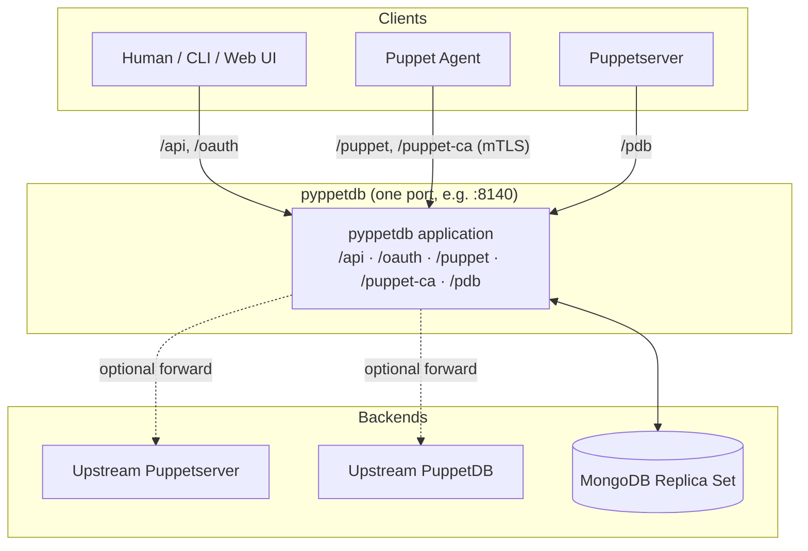
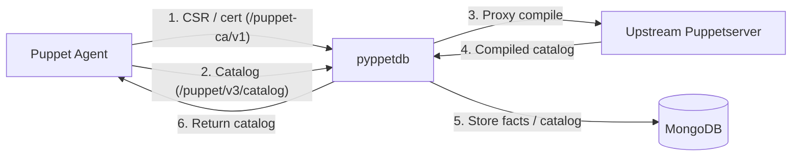
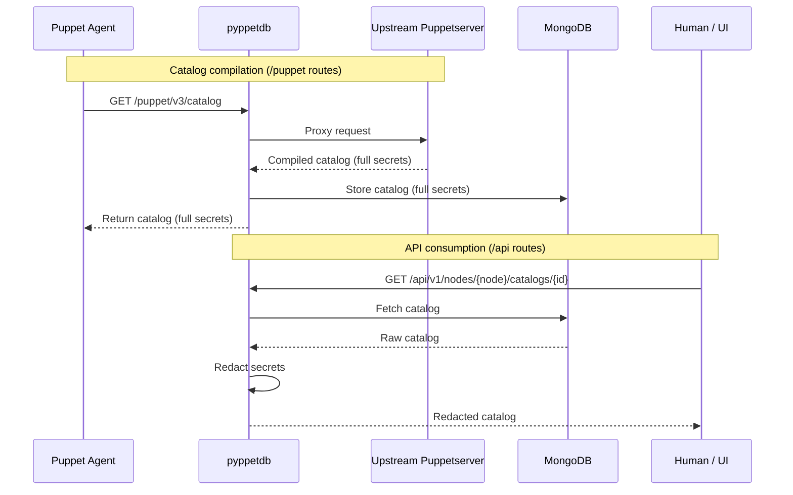
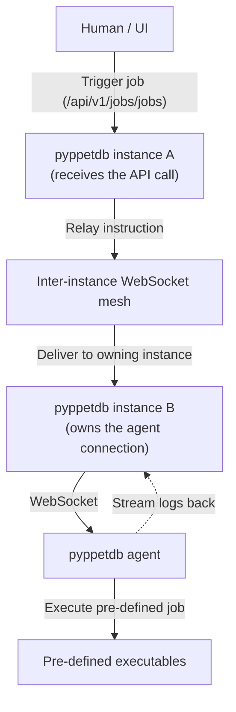

# Architecture & Deployment Scenarios

This page describes how **pyppetdb** is structured internally and the common ways to deploy it.

## 1. Component Overview

pyppetdb is a **single FastAPI application** that listens on **one port**. It exposes three router
groups, all served from that same port and distinguished by their URL prefix:

| Router group | Enable flag | URL prefixes | Purpose |
|--------------|-------------|--------------|---------|
| Management API | `app_main_enable` | `/api`, `/oauth` | REST API for users, web UI, and inter-instance communication |
| Puppet Proxy | `app_puppet_enable` | `/puppet`, `/puppet-ca` | Puppetserver front-end and Puppet CA implementation |
| PuppetDB Proxy | `app_puppetdb_enable` | `/pdb` | PuppetDB command/query endpoints |

!!! important "One port for everything"
    A pyppetdb process binds to a single address/port pair (`app_main_host` / `app_main_port`) and
    uses a single TLS configuration (`app_main_ssl_*`). Puppet agents, Puppetserver, and the web UI
    all connect to the **same** port and are routed by URL path. The `*_enable` flags turn
    individual router groups on or off.

    For high availability and scale, run **several identical pyppetdb replicas** (all router groups
    enabled, same port) behind a load balancer. They share one MongoDB and coordinate over the
    inter-instance WebSocket mesh (see section 4).

## 2. Agent Interaction & Data Flow

From a Puppet Agent's perspective, pyppetdb is the entry point for both certificate management and
catalog compilation. The agent authenticates via mTLS; pyppetdb validates the client certificate
against its own CA records before proxying (see `app_main_ssl_*` and
`ca_verifyCertificateRegistration`).

## 3. Secret Redaction Strategy

Redaction is applied at read time, when data is served over the `/api` routes. The Puppet Agent
(on the `/puppet` routes) needs the unredacted catalog to configure the system, while humans and
API consumers only ever see redacted data. Redaction happens even for deeply nested values and for
job logs.

## 4. Secure Job Execution (Inter-Instance WebSocket)

The pyppetdb agent connects to one pyppetdb instance over a WebSocket. When you run several
replicas behind a load balancer, a user's job request may land on a *different* instance than the
one that holds the target agent's connection. The instances form a mesh and relay the instruction
over an internal WebSocket channel (`app_main_interApiIdleTimeout` controls its idle timeout) to
the instance that owns the agent connection.

## 5. Storage

pyppetdb stores all state in **MongoDB** and requires a **replica set**, because it relies on
[change streams](https://www.mongodb.com/docs/manual/changeStreams/) to react to data changes
in real time (cache invalidation, inter-instance coordination, live job logs) instead of
polling. See the [Setup](setup.md#mongodb-setup) guide for details. Shard-capable collections
can be distributed using placement facts (`mongodb_placementFacts`).
