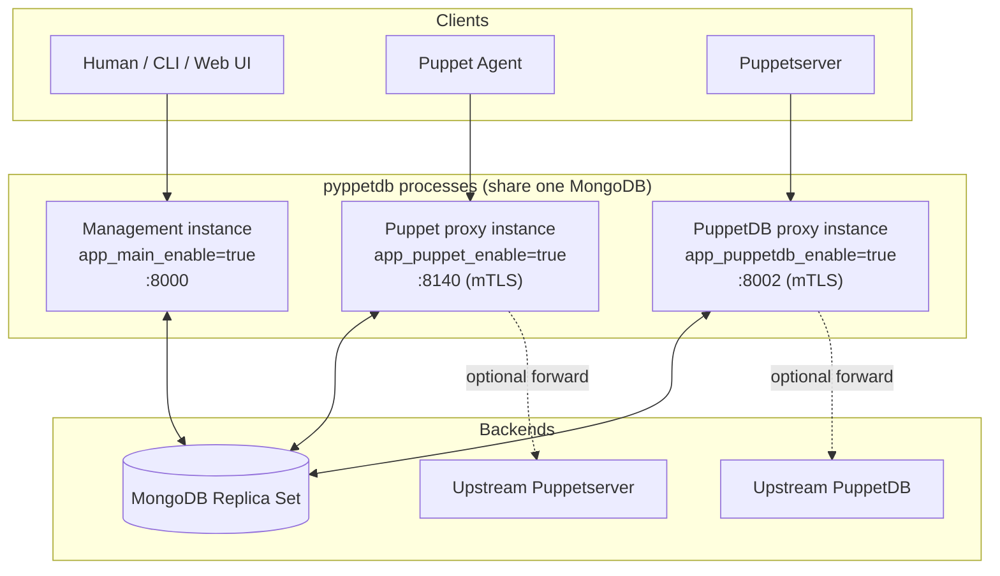
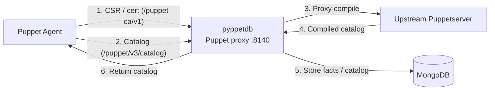
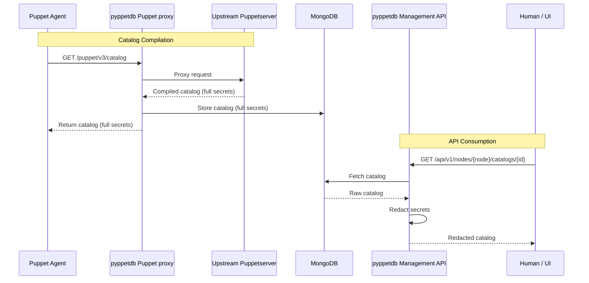
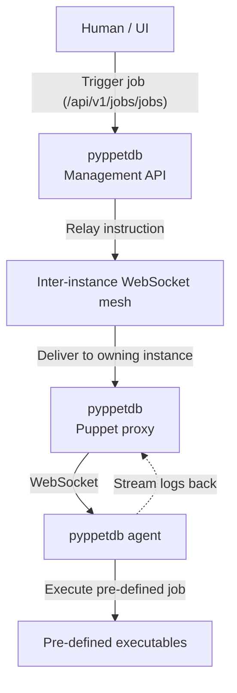

# Architecture & Deployment Scenarios

This page describes how **pyppetdb** is structured internally and the common ways to deploy it.

## 1. Component Overview

pyppetdb is a **single FastAPI application**. It exposes three independent router groups that
are toggled individually via configuration flags:

| Router group | Enable flag | URL prefixes | Purpose |
|--------------|-------------|--------------|---------|
| Management API | `app_main_enable` | `/api`, `/oauth` | REST API for users, web UI, and inter-instance communication |
| Puppet Proxy | `app_puppet_enable` | `/puppet`, `/puppet-ca` | Puppetserver front-end and Puppet CA implementation |
| PuppetDB Proxy | `app_puppetdb_enable` | `/pdb` | PuppetDB command/query endpoints |

!!! important "One process listens on exactly one port"
    Regardless of which router groups are enabled, a pyppetdb process always binds to a single
    address/port pair (`app_main_host` / `app_main_port`) and uses a single TLS configuration
    (`app_main_ssl_*`). You do **not** configure a separate port per router group.

    To separate concerns across ports (e.g. terminate Puppet agent mTLS on `:8140` while serving
    the management UI on `:8000`), run **multiple pyppetdb processes** — each with a different set
    of `*_enable` flags and a different `app_main_port` — all backed by the same MongoDB. For
    small setups you can also run a single all-in-one process with every router group enabled.

## 2. Agent Interaction & Data Flow

From a Puppet Agent's perspective, the Puppet proxy instance is the entry point for both
certificate management and catalog compilation. The agent authenticates via mTLS; pyppetdb
validates the client certificate against its own CA records before proxying (see
`app_main_ssl_*` and `ca_verifyCertificateRegistration`).

## 3. Secret Redaction Strategy

Redaction is applied at read time in the **Management API**. The Puppet Agent needs the
unredacted catalog to configure the system, while humans and API consumers only ever see
redacted data. Redaction happens even for deeply nested values and for job logs.

## 4. Secure Job Execution (Inter-Instance WebSocket)

The pyppetdb agent connects to a Puppet proxy instance over a WebSocket. When a user triggers a
job on the Management API, the target agent may be connected to a *different* pyppetdb instance.
pyppetdb instances form a mesh and relay the instruction over an internal WebSocket channel
(`app_main_interApiIdleTimeout` controls its idle timeout) to the instance that holds the agent
connection.

## 5. Storage

pyppetdb stores all state in **MongoDB** and requires a **replica set**, because it relies on
[change streams](https://www.mongodb.com/docs/manual/changeStreams/) to react to data changes
in real time (cache invalidation, inter-instance coordination, live job logs) instead of
polling. See the [Setup](setup.md#mongodb-setup) guide for details. Shard-capable collections
can be distributed using placement facts (`mongodb_placementFacts`).
