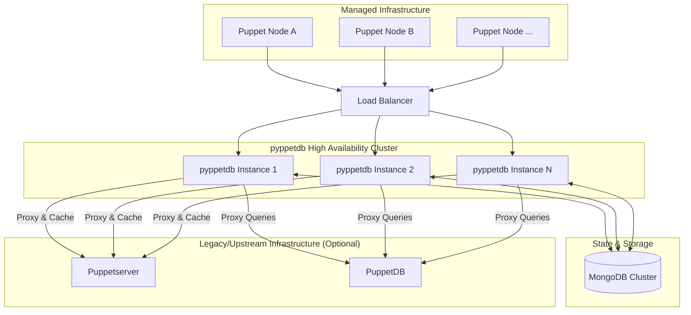
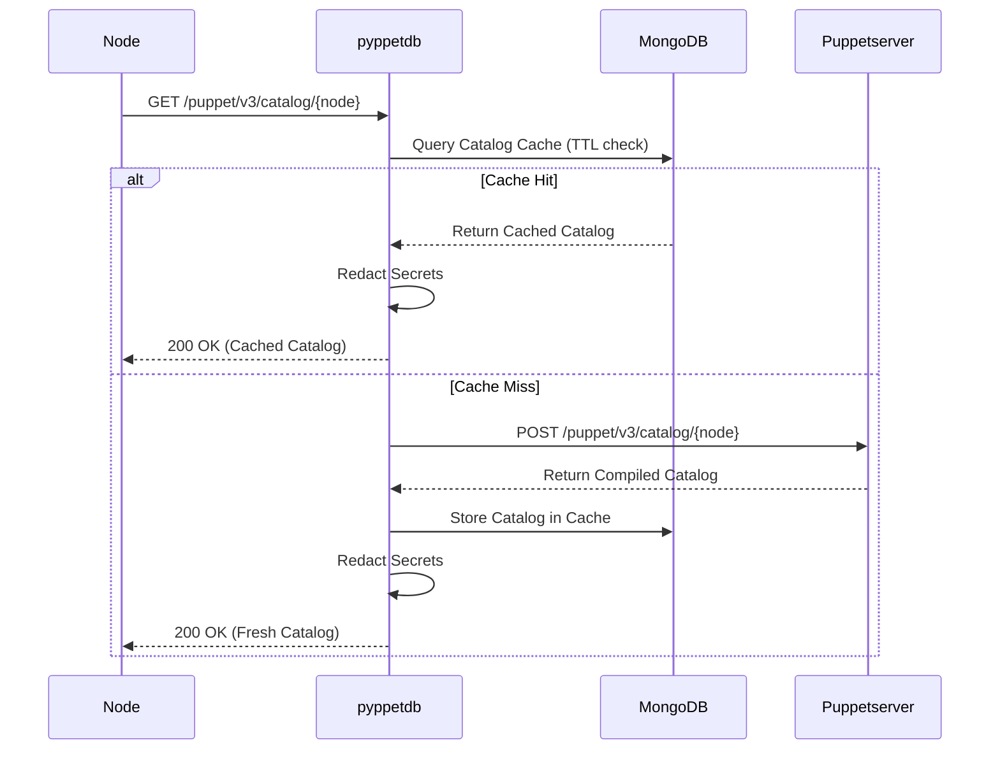
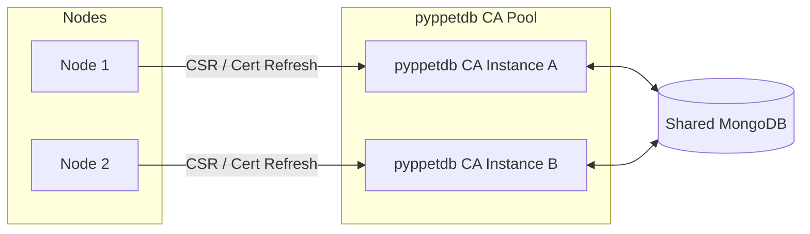
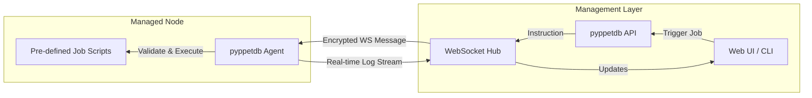

# Architecture & Deployment Scenarios

This page describes common deployment scenarios for **pyppetdb** using Mermaid diagrams.

## 1. Full Proxy and Backend Architecture

In a standard deployment, pyppetdb acts as a high-performance middleware between your Puppet nodes and the traditional Puppet infrastructure (Puppetserver, PuppetDB).

## 2. Catalog Caching & Redaction Flow

This diagram illustrates how pyppetdb offloads catalog requests and ensures sensitive data is redacted before reaching the node.

## 3. High-Availability Puppet CA

Unlike the standard Puppet CA which is often a single point of failure, pyppetdb allows any node in the cluster to handle CA operations by backing the certificate state in MongoDB.

## 4. Secure Job Execution (pyppetdb-agent)

The job execution engine uses a secure, bidirectional communication channel between the pyppetdb API and the agents.

