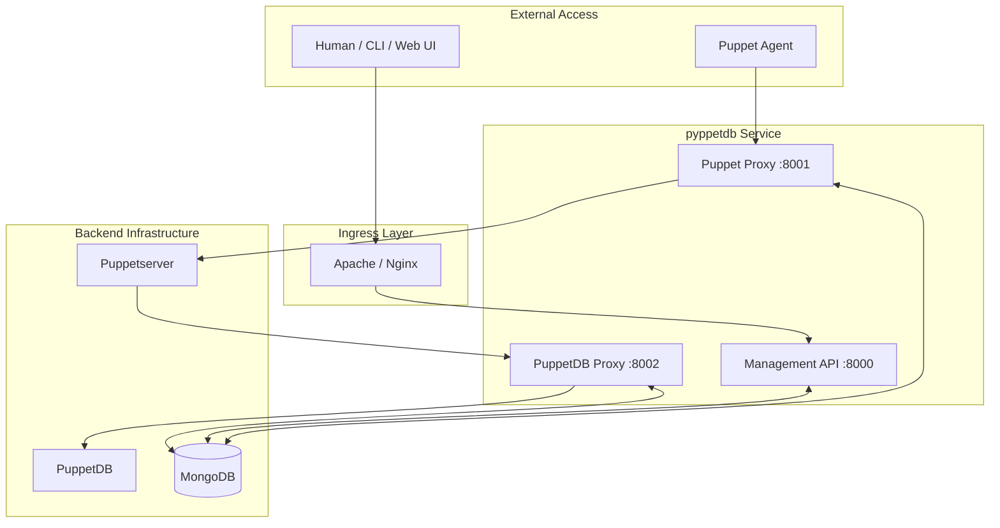
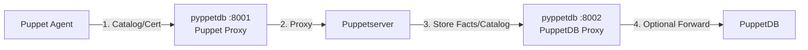
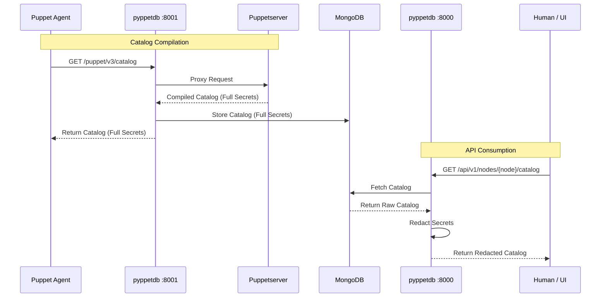
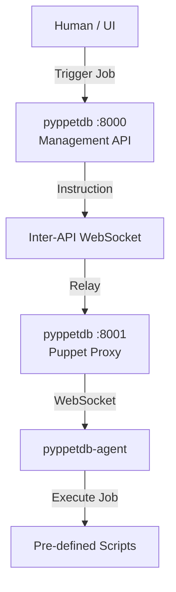

# Architecture & Deployment Scenarios

This page describes common deployment scenarios and data flows for **pyppetdb**.

## 1. Component Overview

pyppetdb consists of three primary functional components, typically listening on different ports:

*   **Puppet API Proxy (Port 8001)**: Handles Puppetserver and CA replacement/proxying.
*   **PuppetDB API Proxy (Port 8002)**: Handles PuppetDB query proxying.
*   **Management API (Port 8000)**: The main REST API for users, frontends, and inter-service communication.

## 2. Agent Interaction & Data Flow

From the perspective of a Puppet Agent, pyppetdb acts as the entry point for both catalog compilation and data submission. Note that the Puppetserver must be co-located or accessible to the Puppet Proxy.

## 3. Secret Redaction Strategy

Redaction is applied at the **Management API** level. The Puppet Agent requires unredacted secrets to configure the system, while humans and external consumers of the API see redacted data.

## 4. Secure Job Execution (Inter-API WebSocket)

When a user triggers a job, the request traverses the management API and uses an internal WebSocket channel to reach the specific pyppetdb instance managing the agent connection.

