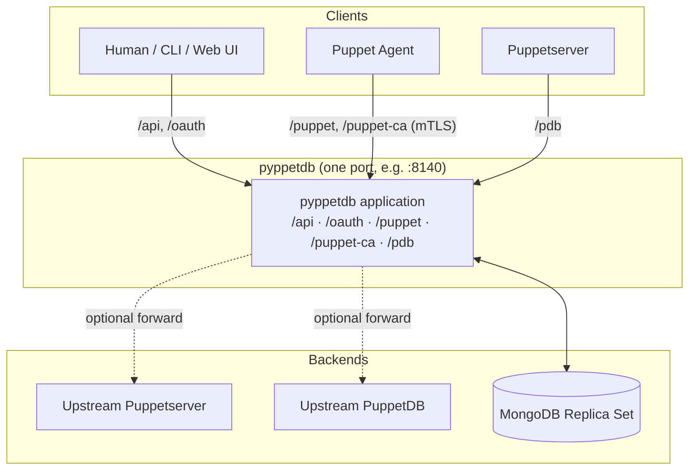
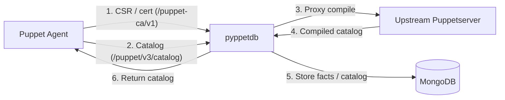
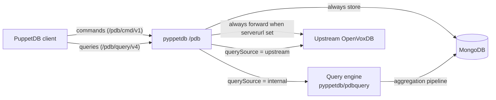
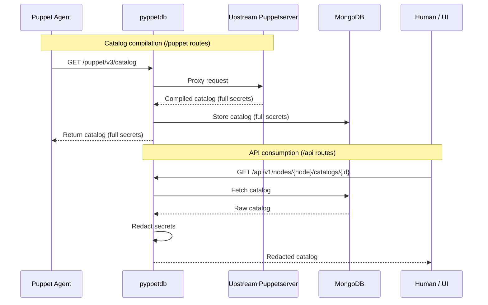
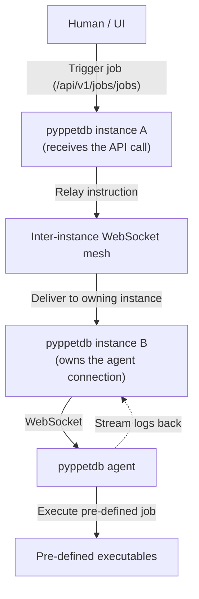

# Architecture & Deployment Scenarios

This page describes how **pyppetdb** is structured internally and the common ways to deploy it.

## 1. Component Overview

pyppetdb is a **single FastAPI application** that listens on **one port**. It exposes three router
groups, all served from that same port and distinguished by their URL prefix:

| Router group | Enable flag | URL prefixes | Purpose |
|--------------|-------------|--------------|---------|
| Management API | `app_main_enable` | `/api`, `/oauth` | REST API for users, web UI, and inter-instance communication |
| Puppet Proxy | `app_puppet_enable` | `/puppet`, `/puppet-ca` | Puppetserver front-end and Puppet CA implementation |
| PuppetDB Proxy | `app_puppetdb_enable` | `/pdb` | PuppetDB command/query endpoints |

!!! important "One port for everything"
    A pyppetdb process binds to a single address/port pair (`app_main_host` / `app_main_port`) and
    uses a single TLS configuration (`app_main_ssl_*`). Puppet agents, Puppetserver, and the web UI
    all connect to the **same** port and are routed by URL path. The `*_enable` flags turn
    individual router groups on or off.

    For high availability and scale, run **several identical pyppetdb replicas** (all router groups
    enabled, same port) behind a load balancer. They share one MongoDB and coordinate over the
    inter-instance WebSocket mesh (see section 4).

```mermaid
graph TD
    subgraph "Clients"
        User[Human / CLI / Web UI]
        Agent[Puppet Agent]
        PS[Puppetserver]
    end

    subgraph "pyppetdb (one port, e.g. :8140)"
        PP["pyppetdb application<br/>/api · /oauth · /puppet · /puppet-ca · /pdb"]
    end

    subgraph "Backends"
        UPS_PS[Upstream Puppetserver]
        UPS_PDB[Upstream PuppetDB]
        DB[(MongoDB Replica Set)]
    end

    User -- "/api, /oauth" --> PP
    Agent -- "/puppet, /puppet-ca (mTLS)" --> PP
    PS -- "/pdb" --> PP
    PP -. optional forward .-> UPS_PS
    PP -. optional forward .-> UPS_PDB
    PP <--> DB
```

## 2. Agent Interaction & Data Flow

From a Puppet Agent's perspective, pyppetdb is the entry point for both certificate management and
catalog compilation. The agent authenticates via mTLS; pyppetdb validates the client certificate
against its own CA records before proxying (see `app_main_ssl_*` and
`ca_verifyCertificateRegistration`).

```mermaid
graph LR
    Node[Puppet Agent]
    P1["pyppetdb"]
    UPS[Upstream Puppetserver]
    DB[(MongoDB)]

    Node -- "1. CSR / cert (/puppet-ca/v1)" --> P1
    Node -- "2. Catalog (/puppet/v3/catalog)" --> P1
    P1 -- "3. Proxy compile" --> UPS
    UPS -- "4. Compiled catalog" --> P1
    P1 -- "5. Store facts / catalog" --> DB
    P1 -- "6. Return catalog" --> Node
```

## 3. PuppetDB Command & Query API

The `/pdb` routes implement the PuppetDB API against pyppetdb's own MongoDB store. Commands are
always written locally, and additionally forwarded to `app_puppetdb_serverurl` when an upstream
OpenVoxDB is configured. Queries are answered locally or proxied upstream depending on
`app_puppetdb_querySource`.

```mermaid
graph LR
    C[PuppetDB client]
    P["pyppetdb /pdb"]
    E["Query engine<br/>pyppetdb/pdbquery"]
    DB[(MongoDB)]
    UPS[Upstream OpenVoxDB]

    C -- "commands (/pdb/cmd/v1)" --> P
    P -- "always store" --> DB
    P -- "always forward when serverurl set" --> UPS
    C -- "queries (/pdb/query/v4)" --> P
    P -- "querySource = internal" --> E
    E -- "aggregation pipeline" --> DB
    P -- "querySource = upstream" --> UPS
```

`pyppetdb/pdbquery/` holds the query engine: `entities.py` maps each PuppetDB entity onto the
MongoDB documents (as a projection whose keys are the PuppetDB column names), `ast.py` parses and
compiles the AST query language into a `$match` document, `engine.py` assembles and runs the
aggregation pipeline, and `paging.py` and `event_counts.py` cover the remaining query parameters.
Entities whose rows cannot be produced by an aggregation pipeline (`fact-paths`,
`fact-contents`) are expanded in Python and filtered with the evaluator in `matcher.py`.

The compiled `$match` is written in PuppetDB column names and therefore has to sit behind
the `$project` that renames storage paths into columns — which would leave MongoDB unable
to use an index. The engine therefore derives two additional filters from it:
a **document pre-filter** in storage paths that runs before every other stage (and hits
the `catalog.resources.*` indexes), and an **element filter** that is pushed into the
`$filter` of the projection so that arrays are narrowed before `$unwind` rather than
after. Both are derived only from clauses in positive polarity — anything under `not`,
an `or` with a branch that yields nothing, and equality against an `$ifNull` default are
skipped — so they can only ever match too much, never too little. The exact `$match`
behind the projection stays in place and decides the result.

See [PuppetDB](puppetdb.md) for the endpoint and query-language reference.

## 4. Secret Redaction Strategy

Redaction is applied at read time, when data is served over the `/api` routes. The Puppet Agent
(on the `/puppet` routes) needs the unredacted catalog to configure the system, while humans and
API consumers only ever see redacted data. Redaction happens even for deeply nested values and for
job logs.

```mermaid
sequenceDiagram
    participant Node as Puppet Agent
    participant PP as pyppetdb
    participant PS as Upstream Puppetserver
    participant DB as MongoDB
    participant User as Human / UI

    Note over Node, PS: Catalog compilation (/puppet routes)
    Node->>PP: GET /puppet/v3/catalog
    PP->>PS: Proxy request
    PS-->>PP: Compiled catalog (full secrets)
    PP->>DB: Store catalog (full secrets)
    PP-->>Node: Return catalog (full secrets)

    Note over PP, User: API consumption (/api routes)
    User->>PP: GET /api/v1/nodes/{node}/catalogs/{id}
    PP->>DB: Fetch catalog
    DB-->>PP: Raw catalog
    PP->>PP: Redact secrets
    PP-->>User: Redacted catalog
```

## 5. Secure Job Execution (Inter-Instance WebSocket)

The pyppetdb agent connects to one pyppetdb instance over a WebSocket. When you run several
replicas behind a load balancer, a user's job request may land on a *different* instance than the
one that holds the target agent's connection. The instances form a mesh and relay the instruction
over an internal WebSocket channel (`app_main_interApiIdleTimeout` controls its idle timeout) to
the instance that owns the agent connection.

```mermaid
graph TD
    User[Human / UI]
    API["pyppetdb instance A<br/>(receives the API call)"]
    WS[Inter-instance WebSocket mesh]
    Proxy["pyppetdb instance B<br/>(owns the agent connection)"]
    Agent[pyppetdb agent]

    User -- "Trigger job (/api/v1/jobs/jobs)" --> API
    API -- "Relay instruction" --> WS
    WS -- "Deliver to owning instance" --> Proxy
    Proxy -- "WebSocket" --> Agent
    Agent -- "Execute pre-defined job" --> Jobs[Pre-defined executables]
    Agent -. "Stream logs back" .-> Proxy
```

## 6. Storage

pyppetdb stores all state in **MongoDB** and requires a **replica set**, because it relies on
[change streams](https://www.mongodb.com/docs/manual/changeStreams/) to react to data changes
in real time (cache invalidation, inter-instance coordination, live job logs) instead of
polling. See the [Setup](setup.md#mongodb-setup) guide for details. Shard-capable collections
can be distributed using placement facts (`mongodb_placementFacts`).
